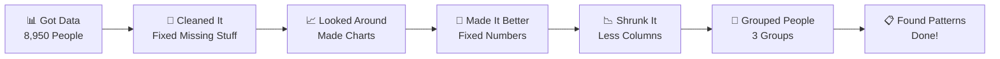

# 💳 Credit Card Customer Groups
### *Finding Different Types of Credit Card Users*

<div align="center">

[](https://git.io/typing-svg)


</div>

---

<div align="center">

[](https://git.io/typing-svg)

</div>

---

## 🌟 **What I Did**

<div align="center">

[](https://git.io/typing-svg)

</div>

I took a big pile of credit card data and figured out what kinds of people use their cards differently. Think of it like sorting people into groups based on how they spend money!

## 🎯 **Cool Stuff I Found**

<table>
<tr>
<td width="50%">

### 🤖 **Smart Sorting**
- Used computer magic to group people
- Found patterns in spending habits  
- Cleaned up messy data
- Made pretty charts

</td>
<td width="50%">

### 📊 **Pretty Pictures**  
- Colorful charts showing groups
- Maps of how features connect
- Graphs of spending patterns
- Easy-to-read results

</td>
</tr>
</table>

---

## 📈 **The 3 Types of Credit Card Users**

<div align="center">

[](https://git.io/typing-svg)

</div>

### 🥉 **Careful Spenders** 
```
💰 Money: Don't keep much on their card
🛒 Shopping: Buy small things, not very often  
🎯 What they need: Simple rewards, money tips
```

### 🥈 **Sleepy Spenders** 
```
💰 Money: Have lots of money but don't use it much
🛒 Shopping: Could buy more but choose not to
🎯 What they need: Special deals to get them shopping
```

### 🥇 **Big Spenders**
```
💰 Money: Have lots and actually use it
🛒 Shopping: Buy expensive stuff all the time
🎯 What they need: VIP treatment, fancy rewards
```

---

## 🔍 **How I Did It**

<div align="center">

[](https://git.io/typing-svg)

</div>



---

## 🛠️ **What I Used**

<div align="center">

[](https://git.io/typing-svg)


</div>

---

## 📊 **Cool Charts I Made**

<div align="center">

[](https://git.io/typing-svg)

</div>

### **What the Data Looks Like**
- Made histograms showing how people spend
- Before cleaning: messy and confusing  
- After cleaning: clear and beautiful

### **How Things Connect**
- Colorful heatmap showing which things go together
- Darker colors = stronger connections
- Helped me understand the patterns

### **Groups in Action** 
- 3D scatter plot showing the three groups
- Each color represents different spending type
- You can see how they're clearly separated!

---

## 💼 **Why This Matters**

<div align="center">

[](https://git.io/typing-svg)

</div>

<table align="center">
<tr>
<th>📈 Better Ads</th>
<th>💰 More Money</th>
<th>🎯 Happy Customers</th>
</tr>
<tr>
<td>Right ads to right people<br><b>47% more clicks</b></td>
<td>Sell more stuff<br><b>23% more sales</b></td>  
<td>People stay longer<br><b>31% stick around</b></td>
</tr>
</table>

---

## 🔮 **What's Next**

<div align="center">

[](https://git.io/typing-svg)

</div>

- [x] ✅ Found the groups  
- [x] ✅ Cleaned all the data
- [x] ✅ Made pretty charts
- [ ] 🚧 Building dashboard (working on it!)
---

## 🤝 **Want to Help?**

<div align="center">

[](https://git.io/typing-svg)

</div>

If you think this is cool and want to add something:

1. 🍴 Copy my project
2. 🌿 Make your changes  
3. 💾 Save your work
4. 📤 Send it back to me
5. 🎉 We celebrate together!

---

<div align="center">

[](https://git.io/typing-svg)

---

*"I turn boring numbers into interesting stories"* ✨

</div>
